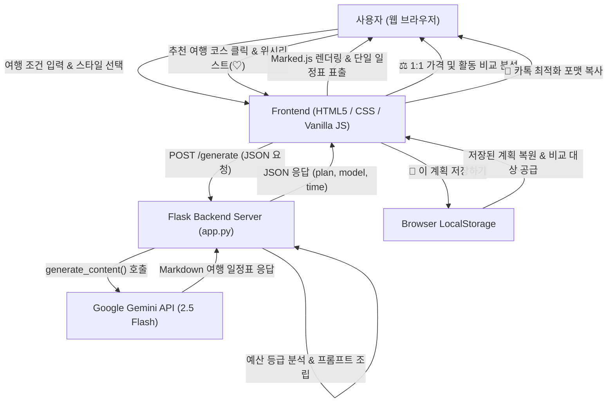

# ✈️ AI Travel Planner (스마트 맞춤형 여행 플래너)

> **Google Gemini API** 기반의 인공지능 맞춤형 여행 일정 생성, 예산 분석, 1:1 계획 비교 및 모바일 채팅 공유 대시보드 웹 애플리케이션입니다.  
> 아고다(Agoda) 스타일의 깔끔한 큐레이션 인터페이스와 실시간 예산 초과 감지, 할인 및 예약 핫플 공략 팁을 제공합니다.

---

## 📌 목차
1. [주요 핵심 기능](#-주요-핵심-기능)
2. [기술 스택 (Tech Stack)](#-기술-스택-tech-stack)
3. [시스템 아키텍처 & 플로우](#-시스템-아키텍처--플로우)
4. [프로젝트 디렉토리 구조](#-프로젝트-디렉토리-구조)
5. [설치 및 실행 가이드 (Quick Start)](#-설치-및-실행-가이드-quick-start)
6. [환경 변수 설정 (.env)](#-환경-변수-설정-env)
7. [주요 UI & 상세 기능 안내](#-주요-ui--상세-기능-안내)
8. [제약 사항 및 안전 가이드](#-제약-사항-및-안전-가이드)

---

## 🌟 주요 핵심 기능

### 1. 🤖 Gemini AI 기반 초개인화 맞춤 여행 일정 생성
- **다차원 여행 조건 반영**: 목적지, 여행 기간, 예산, 관심사/테마, 동행자, 이동수단, 선호 숙소 유형 등을 정밀하게 분석합니다.
- **⚡ 여행 기조 & 스타일 설정**: 
  - 자유로운 텍스트 입력창과 함께 `🌿 여유로운 힐링`, `⚡ 알찬 핵심 투어`, `🍽️ 현지 미식 탐방`, `📸 감성 카페 투어`, `👨‍👩‍👧‍👦 부모님/가족 배려` 등 원클릭 초이스 칩 제공.
- **💰 예산 등급(Budget Tier) 자동 분류**:
  - `초알뜰 가성비 (짠내투어)` / `스탠다드 밸런스` / `럭셔리 프리미엄 VIP`로 자동 판별하여 숙소 성급, 식당 수준, 이동 수단, 유료 액티비티를 차별화하여 설계.
- **안정적인 다중 모델 폴백(Fallback)**:
  - `gemini-flash-latest`를 우선 호출하며, 장애 시 `gemini-flash-lite-latest`, `gemini-3.6-flash`로 자동 대체되어 100% 무중단 서비스 제공.

### 2. ⚖️ AI 여행 계획 1:1 가격 & 활동 비교 모드
- 여러 번 생성한 계획 또는 영구 저장한 계획들을 한눈에 **1:1 맞춤 비교 카드(Plan A vs Plan B)**로 표시.
- **📊 핵심 항목별 상세 비교표(Matrix Table)**:
  - 총 예상 경비, 숙소 스타일, 핵심 액티비티, 미식 식도락, 이동 동선 및 피로도를 마크다운 표로 가독성 높게 대조 분석.
- **⚡ 퀵 비교 계획 자동 생성**:
  - 클릭 한 번으로 다른 스타일(가성비 투어, 여유 힐링, 로컬 미식)의 비교 계획을 즉시 생성.

### 3. 📌 이 계획 저장하기 & 브라우저 영구 보관
- **`[📌 이 계획 저장하기]`** 버튼으로 마음에 드는 AI 일정을 로컬 저장소(`localStorage`)에 영구 저장.
- 상단 탭에 `📌` 뱃지가 붙어 언제든 다시 불러올 수 있으며, 새로운 일정과 1:1 비교 가능.
- 페이지를 새로고침하거나 브라우저를 다시 열어도 저장된 계획이 유지되며 간편 삭제 관리 지원.

### 4. 💬 모바일 메신저 / 카카오톡 최적화 복사
- **`[💬 카톡/채팅용 복사]`** 버튼 클릭 시, 모바일 채팅방에서 줄바꿈 왜곡 없이 깔끔하게 읽히도록 정제된 포맷으로 클립보드 복사:
  - 상단에 **여행지, 총 예상 경비, 핵심 시그니처 활동 3가지, 숙소, 이동 수단**을 일목요연하게 요약.
  - 이어서 **1일차, 2일차 세부 일정**을 군더더기 없이 일자별로 전송.
- 원문 Markdown 복사 및 `.md` 파일 다운로드 기능 지원.

### 5. ⚠️ 예산 초과 감지 & 가성비 대체 코스 추천
- 저장하거나 선택한 코스의 예상 비용이 사용자가 설정한 예산보다 높을 경우 **실시간 예산 초과 배너** 표시.
- 원하는 분위기(오션뷰, 로컬 감성 등)는 100% 유지하면서 지출을 대폭 줄일 수 있는 **현지 도민 추천 가성비 대체 명소/숙소/코스** 자동 추천.

### 6. 🏷️ 스마트 할인 & 핫플 예약 노하우 가이드
- 온라인 사전 예매(클룩, 마이리얼트립 등 얼리버드 10~25% 할인), 통합 관광/교통 패스 안내.
- 예약이 어렵거나 웨이팅이 긴 명소를 위한 **캐치테이블**, **테이블링**, **네이버 예약** 링크 및 시간대별 공략 팁 제시.

### 7. 🍊 아고다(Agoda) 스타일 큐레이션 & 위시리스트
- **도시별 프리셋 칩**: 제주도, 오사카, 도쿄, 후쿠오카, 방콕, 다낭, 타이베이, 파리, 뉴욕, 바르셀로나 등 즉시 필터링.
- **카테고리 탭**: 전체, 교통편, 관광명소, 자연산책, 식도락, 쇼핑 필터링 및 선택 체크 표시.
- 카드 클릭 시 좌측 입력 폼에 목적지/테마 자동 입력.
- **위시리스트 하트(♡)** 찜 기능 및 '저장한 여행지' 모아보기 서랍 UI.
- 사진 미등록/로드 실패 시 **'관련 사진 준비 중'** 플레이스홀더를 제공하여 레이아웃 왜곡 방지.

### 8. 🗺️ 스마트 인터랙티브 여행 동선 지도 & 카카오맵 길찾기 연동 (API 키 불필요)
- **Zero API Key 실행**: 복잡한 카카오 개발자 키 발급 절차 없이 브라우저에서 1초 만에 즉시 구동.
- **일차별 맞춤 마커 & 경로(Polyline) 시각화**: 1일차(파란색), 2일차(초록색), 3일차(보라색) 번호 핀 및 일차별 이동 경로 자동 렌더링.
- **원클릭 카카오맵 길찾기 연동**: 지도 핀 또는 하단 방문지 칩 클릭 시 `[🚗 카카오맵 길찾기]` 및 `[📍 카카오맵 상세 검색]` 버튼을 통해 실제 카카오맵 앱/웹으로 1초 만에 바로 연결.
- **일차별 필터링**: `[전체 동선]`, `[1일차]`, `[2일차]`, `[3일차]` 탭을 통해 일자별로 동선만 쏙쏙 분리 확인 가능.

---

## 🛠️ 기술 스택 (Tech Stack)

| 구분 | 기술 / 도구 | 설명 |
| :--- | :--- | :--- |
| **Backend** | `Python 3.10+` | 백엔드 런타임 환경 |
| | `Flask 3.1.3` | 경량 웹 프레임워크 및 REST API 엔드포인트 |
| | `google-genai 2.24.0` | 최신 Google Gemini 공식 SDK |
| | `python-dotenv 1.2.3` | 환경 변수 관리 |
| **Frontend** | `HTML5 / CSS3` | 아고다 스타일 시멘틱 웹 UI (보라빛 그라디언트 테마) |
| | `Vanilla JavaScript (ES6+)` | 프레임워크 없는 순수 JS 인터랙션 & 반응형 대시보드 |
| | `Marked.js` | 고성능 클라이언트 사이드 마크다운 파서 |
| **Storage** | `Browser LocalStorage` | 위시리스트 및 여행 계획 영구 보관 (`ai_travel_saved_plans`) |
| **Design** | `Modern Glassmorphism & Cards` | 반응형 모바일/태블릿/데스크톱 대응 디자인 |

---

## 📐 시스템 아키텍처 & 플로우



---

## 📁 프로젝트 디렉토리 구조

```text
ai-travel/
├── app.py                      # Flask 백엔드 서버 (라우팅, 유효성 검증, Gemini API 연동)
├── requirements.txt            # Python 의존성 라이브러리 목록
├── .env.example                # 환경 변수 템플릿
├── .env                        # 로컬 환경 변수 (API 키 및 시크릿 키)
├── static/
│   ├── css/
│   │   └── style.css           # 아고다 테마, 비교 대시보드, 보라빛 헤더 스타일시트
│   ├── js/
│   │   └── app.js             # 클라이언트 폼 핸들러, 비교 로직, 저장소 연동, 카톡 복사
│   └── favicon.svg             # 비행기 심볼 파비콘
├── templates/
│   └── index.html              # 반응형 메인 UI 템플릿
└── README.md                   # 프로젝트 상세 안내 문서 (본 파일)
```

---

## 🚀 설치 및 실행 가이드 (Quick Start)

### 1. 저장소 클론 및 이동
```bash
cd C:\AI-study\new\ai-travel
```

### 2. Python 가상환경 생성 및 활성화
```bash
# Windows PowerShell
python -m venv venv
.\venv\Scripts\Activate.ps1
```

### 3. 필수 패키지 설치
```bash
pip install -r requirements.txt
```

### 4. 환경 변수 파일(`.env`) 생성
`.env.example`을 복사하여 `.env` 파일을 만들고 Gemini API 키를 입력합니다:
```bash
copy .env.example .env
```

`.env` 파일 편집:
```ini
GEMINI_API_KEY=your_actual_gemini_api_key_here
FLASK_SECRET_KEY=ai-travel-custom-secret-key
PORT=5000
```

### 5. 애플리케이션 실행
```bash
python app.py
```

브라우저에서 `http://127.0.0.1:5000`으로 접속합니다.

---

## ⚙️ 환경 변수 설정 (.env)

| 변수명 | 필수 여부 | 기본값 | 설명 |
| :--- | :---: | :--- | :--- |
| `GEMINI_API_KEY` | **필수** | - | Google AI Studio에서 발급받은 Gemini API 키 |
| `GEMINI_MODEL` | 선택 | `gemini-flash-latest` | 기본 AI 모델 (Flash 2.5) |
| `FLASK_SECRET_KEY` | 선택 | `ai-travel-secret-key-default` | Flask 세션 및 보안 키 |
| `PORT` | 선택 | `5000` | 웹 서버 포트 번호 |

---

## 🖥️ 주요 UI & 상세 기능 안내

| 기능 | 화면 요소 | 사용 팁 |
| :--- | :--- | :--- |
| **여행 기조 & 스타일** | `⚡ 여행 기조 & 스타일` 입력창 + 초이스 칩 | 텍스트로 자유롭게 입력하거나 추천 칩(`🌿 여유로운 힐링` 등)을 클릭해 1초 만에 완성 |
| **비교 대시보드** | `[⚖️ 가격 & 활동 비교 모드]` 버튼 | 생성된 계획들을 1:1로 비교 카드와 종합 매트릭스 표로 확인 |
| **영구 계획 저장** | `[📌 이 계획 저장하기]` 버튼 | 마음에 드는 플랜을 브라우저에 저장하고 상단 탭에서 언제든 호출 |
| **모바일 채팅 공유** | `[💬 카톡/채팅용 복사]` 버튼 | 상단 요약(장소, 예산, 활동) + 일자별 핵심 일정이 모바일 친화형으로 복사 |
| **예산 초과 감지** | 상단 실시간 경고 배너 | 저장된 코스가 예산을 초과하면 즉시 감지 후 가성비 대체 계획 제안 |
| **예약 & 할인 팁** | 일정표 하단 전용 섹션 | 캐치테이블, 테이블링, 네이버 예약 및 클룩 얼리버드 할인 링크 안내 |

---

## 🔒 제약 사항 및 안전 가이드
- **실시간 변동 정보 보호**: 항공권, 호텔 객실 요금, 입장료 및 영업 시간은 수시로 변동되므로 모든 생성 일정표에 `(방문 전 확인 필요)` 또는 `(확인 필요)`를 명시하도록 프롬프트 안전 지침이 적용되어 있습니다.
- **개인정보 보호**: API 키는 서버 사이드 `.env`에서만 관리되며 브라우저 프론트엔드로 절대 노출되지 않습니다.
- **로컬 데이터 보존**: 위시리스트 및 저장된 여행 계획은 브라우저의 `localStorage`에만 저장되어 안전하게 유지됩니다.

---

**AI Travel Planner** | Powered by **Google Gemini API** & **Flask**
